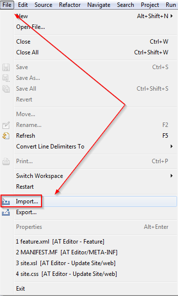
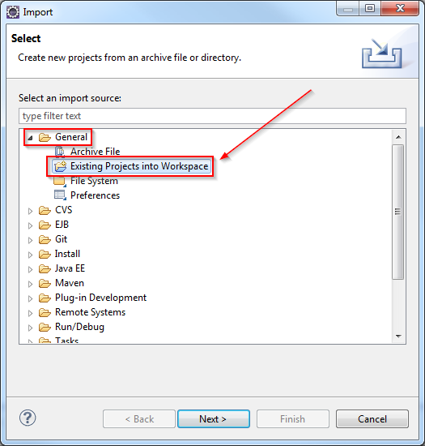
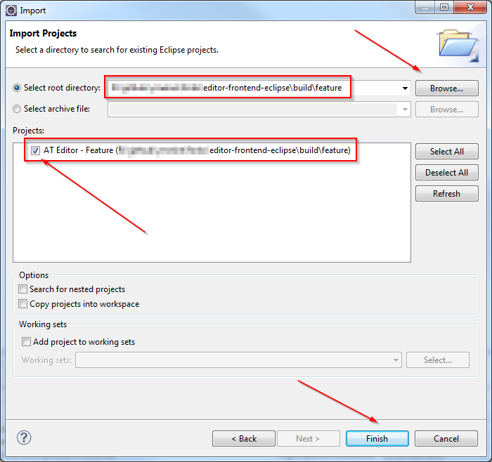

The Eclipse Feature project to package our plugin.

# File system layout

* [`README.md`](./README.md): this current file
* [`.project`](./.project): the Eclipse project configuration
* [`build.properties`](./build.properties): the configuration of the build
* [`feature.xml`](./feature.xml): the feature definition

# Versioning

To version: _everything_.

# Contribute

## Setup

In Eclipse IDE, import an existing project using this [`.project`](./.project) file.

## Build

1. Open [`feature.xml`](./feature.xml) in the IDE, the Feature editor should open

First update the configuration of the feature:

1. In tab `Dependencies`
	1. Click button `Compute`: the result might not change if dependencies were already computed before, however this is necessary to do it to be sure to have the proper configuration
1. Save the file

Then, export the plugin:

1. In tab `Overview`
	1. Click the link `Export Wizard` (3rd point under section `Exporting` on the right)
1. Follow the steps of the wizard
