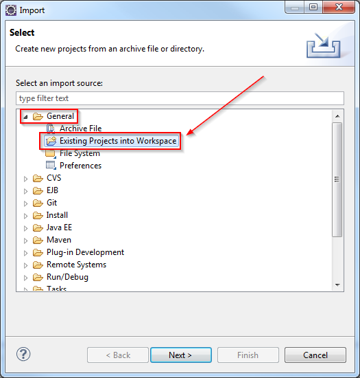

The Eclipse Update site project to package our feature/plugin.

# File system layout

* [`README.md`](./README.md): this current file
* [`.gitignore`](./gitignore): Git related file
* [`.project`](./.project): the Eclipse project configuration

# Versioning

To ignore: all content generated when the site is built.

# Contribute

## Setup

In Eclipse IDE, import an existing project using this [`.project`](./.project) file.

## Build

__There are some prerequisites before executing the build process__:

* first you need to setup the [`feature` project](../feature) and apply the [build procedure](../feature#build) until the _configuration_ step __(included)__
* also (even if this should be in the procedure for the build of the plugin), please ensure that:
	* the node modules have been installed (to grab the backend): running `npm install` at the root of the project
	* the node modules are up to date: same as above but with `npm update`
	* the `node.exe` executable has been downloaded into the folder `runtime` under the root of the project
	* the editor backend has been built
	* you configured the backend to use the port used by the plugin

__For the three last points__, you can run the grunt task `grunt prepare-site` which does that for you (it sets the port to `50000` which is the default used, and downloads a version of node __hard-coded in the gruntfile__).

Then:

1. Be sure to clean all previously generated files by running `grunt clean:site` (not necessary if you ran `grunt prepare-site`)
1. Open [`site.xml`](./site.xml) in the IDE, the Update Site editor should open
1. In main tab `Site Map`, click button `Build All`

    

Then, you can either run the task `grunt package-site` which creates an archive and remove original files, or do it yourself by copying the following content:

* `features/`
* `plugins/`
* `site.xml`

And run `grunt clean:site` to remove the generated content.
